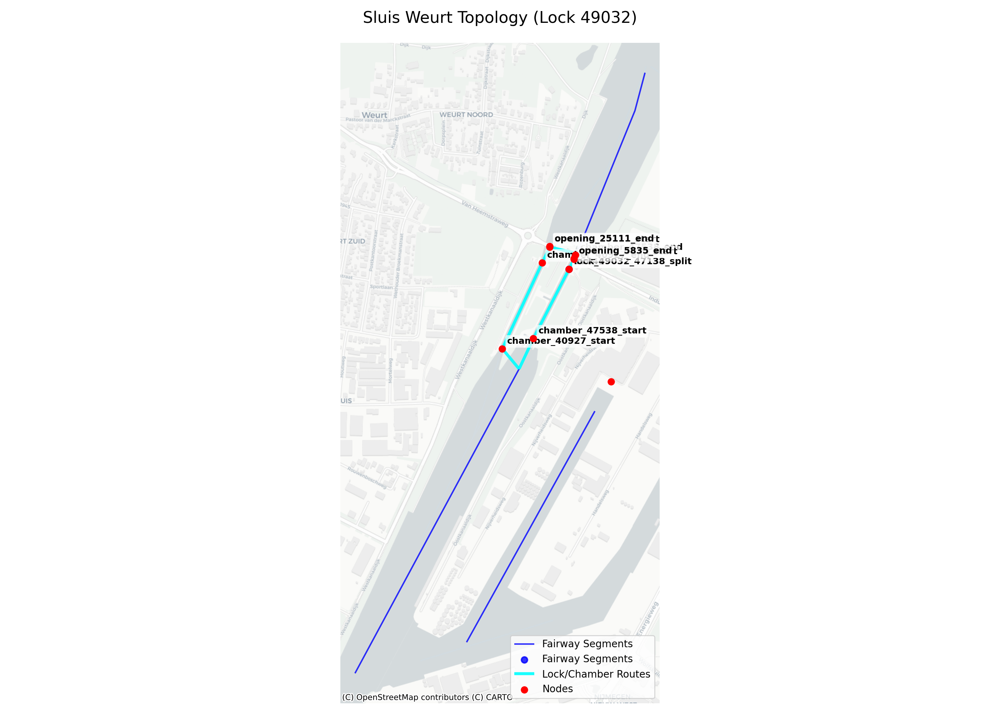
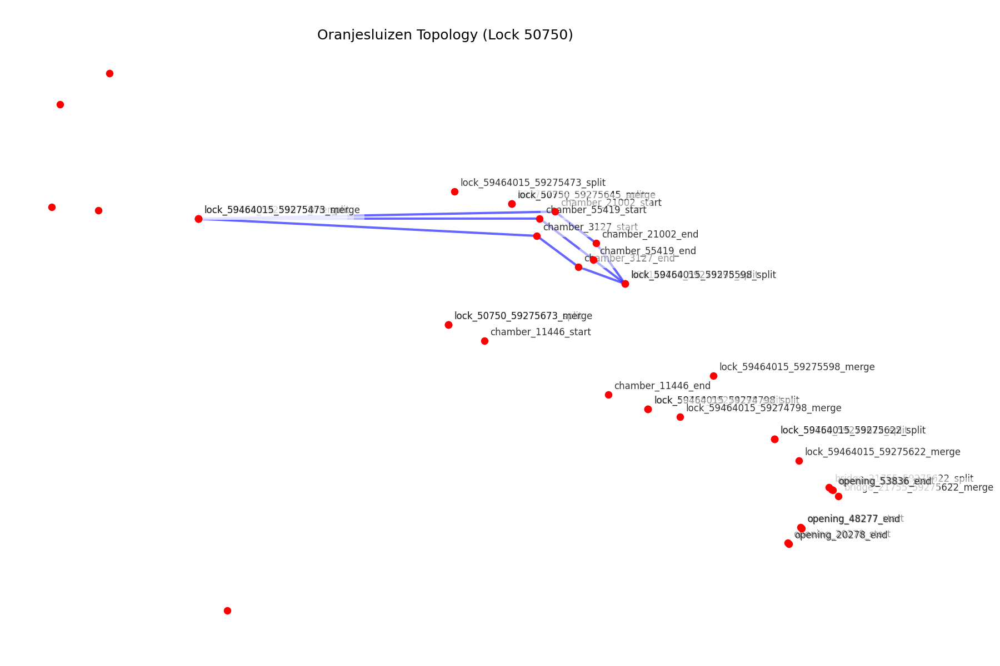

# Current Method for Fairway Splitting and Integration

This document outlines the methodology used in the `fis-crawler` for schematizing lock and bridge structures into the fairway network graph.

## High-Performance UTM-based Splicing

The fundamental operation for inserting a structure (lock or bridge) into a fairway is defined in `fis.dropins.splicing` using the `FairwaySplicer` class. The implementation is highly optimized for performance and topological integrity.

### Performance Optimizations
To handle thousands of sections in seconds, the splicer employs several optimization strategies:
1.  **Memoized Coordinate Projections**: UTM CRS estimation and coordinate transformers are cached globally. Centroids are rounded to 0.5° (~50km) to reuse transformers for local clusters, providing a **20x speedup**.
2.  **Pre-calculated String IDs**: All ID string conversions are performed once per section batch, eliminating redundant `stringify_id` overhead during graph construction.
3.  **Lookup Dictionaries**: Drop-ins are indexed into dictionaries keyed by `(type, id)`, replacing expensive linear scans during node assignment.

### Topological Robustness
The splicer is designed to maintain a continuous network graph even in edge cases:
1.  **Virtual Connectivity Segments**: If a structure (or multiple structures) consumes an entire fairway section, the splicer emits **zero-length connectivity segments**. These segments carry no physical geometry but preserve the topological link between source and target nodes, preventing network fragmentation.
2.  **Junction Consumption Tolerance**: A 10-meter tolerance (`SPLICING_JUNCTION_TOLERANCE_M`) is used to detect when a structure buffer overlaps a section's endpoint junction. In such cases, the junction is "unified" with the structure's split or merge node.

---

## Inserting Locks

Locks are processed in `fis.lock.core` and `fis.lock.graph`.

### 1. Spatial Matching & Signed Overlap Scoring
When a lock complex spans multiple parallel or staggered fairway sections (like Sluis Weurt), the algorithm must decide which section each chamber belongs to.
- **Projected Thresholds**: Doors and split/merge points are evaluated in local UTM Cartesian coordinates with a 200m–500m proximity threshold.
- **Signed Scoring**: For chamber exits, we calculate the signed distance `projected_merge - projected_door`. 
    - A **positive score** indicates the merge point is downstream of the door, favoring correct forward routing.
    - This allows staggered parallel chambers to correctly identify their specific fairway segments even when sections are physically adjacent.

### 2. Parallel Branch Convergence
Complex locks often branch from one fairway and merge back into another, or route parallel chambers through different physical sections.
- **Shared Split/Merge Points**: All chambers associated with a specific fairway section share the same `lock_{id}_{section_id}_split` and `lock_{id}_{section_id}_merge` nodes.
- **Junction Unification**: If a section's endpoint is a pre-existing junction (e.g., `8864190`), the lock's `merge` node is assigned that junction's ID. This forces all chambers exiting into that area to **converge back to the same physical node**, ensuring valid downstream routing.

### 3. Passages and Routing
Three sequential edges are generated for each chamber:
1.  **Approach:** `lock_split` -> `chamber_start`
2.  **Route:** `chamber_start` -> `chamber_end`
3.  **Exit:** `chamber_end` -> `lock_merge` (or Unified Junction)

---

## Inserting Bridges & Embedded Structures

### Bridges
Bridges follow a similar paradigm, generating `bridge_{id}_split` and `bridge_{id}_merge` nodes. Multiple openings within a bridge complex generate parallel passage edges between these shared nodes.

### Embedded Bridges
Bridges physically intersecting a lock chamber are handled by `fis.dropins.embedded`. 
- **Injection Proximity**: Junctions and bridge openings are only injected into a chamber route if they are within a **10cm tolerance** of the centerline.
- **Centerline Splicing**: The existing chamber route edge is removed and replaced with a sequence: `chamber_start -> opening_start -> opening_end -> chamber_end`.

---

## Algorithm Visualization

### Sluis Weurt: Staggered Parallel Routing

*Figure 1: Two parallel chambers. Chamber 40927 exit correctly identifies its merge point on section 47138 through opening 25111, while the algorithm prevents backward routing to the junction shared by the other chamber.*

### Oranjesluizen: Multi-Branch Connectivity

*Figure 2: The complex is split across two physical branches. The algorithm correctly partitions chambers to their respective branches without creating invalid cross-links.*
